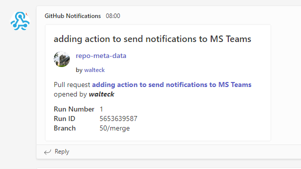

# Notify MSTeams Action

This GitHub action is designed to enable development teams to easily send notifications to an MS Teams channel from their build pipelines.

This action uses typescript and is built from the [typescript-action](https://github.com/actions/typescript-action) baseline

## Table of Contents

- [Notify MSTeams Action](#notify-msteams-action)
  - [Table of Contents](#table-of-contents)
  - [Installation](#installation)
  - [To work on this repository](#to-work-on-this-repository)
    - [Prerequisites](#prerequisites)
  - [Usage](#usage)
  - [Contacts](#contacts)
  - [Licence](#licence)

## Installation

This action can be called as part of your [GitHub action](https://docs.github.com/en/actions/learn-github-actions/understanding-github-actions) workflows. to achieve this follow these steps:

Add the following section to your existing workflow file (pin to a released major tag; the moving `v1` tag will always point at the latest backward-compatible release within the same major):

```yml
      - name: Notify Teams
        uses: nhs-england-tools/notify-msteams-action@v1
        with:
          github-token: ${{ secrets.GITHUB_TOKEN }}
          teams-webhook-url: ${{ secrets.TEAMS_WEBHOOK_URL }}
          message-title: "Replace with an appropriate title"
          message-text: "Replace with appropriate text"
          link: https://example.org
```

Follow the instructions [to add an Incoming Webhook](https://learn.microsoft.com/en-us/microsoftteams/platform/webhooks-and-connectors/how-to/add-incoming-webhook?tabs=dotnet) to the Teams channel of your choice.

Add the webhook URL from above as a [repository secret](https://docs.github.com/en/codespaces/managing-codespaces-for-your-organization/managing-encrypted-secrets-for-your-repository-and-organization-for-github-codespaces#adding-secrets-for-a-repository) with the following name:

```shell
TEAMS_WEBHOOK_URL
```

## To work on this repository

Clone the repository

```shell
git clone https://github.com/nhs-england-tools/notify-msteams.git
cd nhs-england-tools/notify-msteams
```

Install and configure toolchain dependencies

```shell
make config
```

### Prerequisites

The following software packages or their equivalents are expected to be installed

- [node](https://nodejs.org/en/download)

## Usage

The steps above detail how to quickly use this action within your repository. The following attributes can be provided to further control the output of your notification:

- github-token - use the default [GitHub token](https://docs.github.com/en/actions/security-guides/automatic-token-authentication#using-the-github_token-in-a-workflow)
- teams-webhook-url - this is the URL provided by MS Teams when you configured the incoming webhook
- message-title - the title for your message - this will be displayed in the notification
- message-text - the text for your message - this will be displayed in the notification
- message-colour - The colour to use for the header line in the notification
- link - optional if required provide a link to be presented in the notification

An example of how the notification could appear in Microsoft Teams is provided:



### Versioning & Release Process

This repository uses [semantic-release](https://semantic-release.gitbook.io/) to automatically:

- Determine the next version from Conventional Commit messages.
- Generate release notes and create a GitHub Release with tag `vX.Y.Z`.
- Build and bundle the Action (TypeScript -> single `dist/index.js`).
- Commit the generated `dist/` assets, the updated `package.json` (and `package-lock.json`) version metadata, and the `VERSION` file as part of the release commit.
- Update the moving major tag (e.g. `v1`) to point to the latest release of that major.
- Update the consolidated changelog in `CHANGELOG.md`.

Consumers SHOULD depend on a major tag (e.g. `@v1`) or a fully qualified tag (e.g. `@v1.2.3`). The `main` branch is not guaranteed to contain built artefacts and must not be referenced directly in external workflows.

### Contributing (Important Policy About `dist/`)

Do not commit the `dist/` directory in pull requests. The CI pipeline will fail the PR if `dist/` is present. The release workflow rebuilds and commits `dist/` automatically. This keeps review noise low and ensures reproducible builds.

To test local modifications, run:

```bash
npm ci
npm run package
```

Then you can reference the action locally in a workflow within this repository using `uses: ./` (which will use the freshly generated `dist/`).

### Conventional Commits

To trigger proper version bumps, use the Conventional Commits format, for example:

- `feat: add support for message colour`
- `fix: correct Teams webhook error handling`
- `chore: update dependencies`
- `docs: clarify usage section`

Breaking changes must include `!` after the type or the phrase `BREAKING CHANGE:` in the footer.

## Contacts

Provide a way to contact the owners of this project. It can be a team, an individual or information on the means of getting in touch via active communication channels, e.g. opening a GitHub discussion, raising an issue, etc.

## Licence

> The [LICENCE.md](./LICENCE.md) file will need to be updated with the correct year and owner

Unless stated otherwise, the codebase is released under the MIT License. This covers both the codebase and any sample code in the documentation.

Any HTML or Markdown documentation is [© Crown Copyright](https://www.nationalarchives.gov.uk/information-management/re-using-public-sector-information/uk-government-licensing-framework/crown-copyright/) and available under the terms of the [Open Government Licence v3.0](https://www.nationalarchives.gov.uk/doc/open-government-licence/version/3/).
